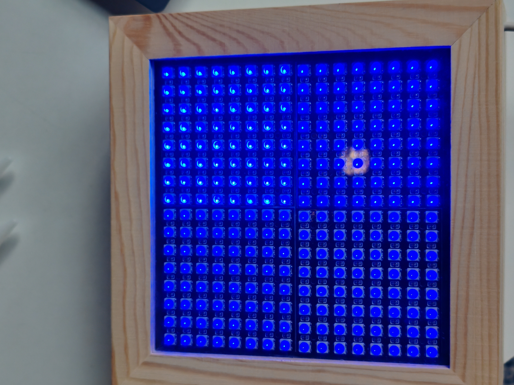
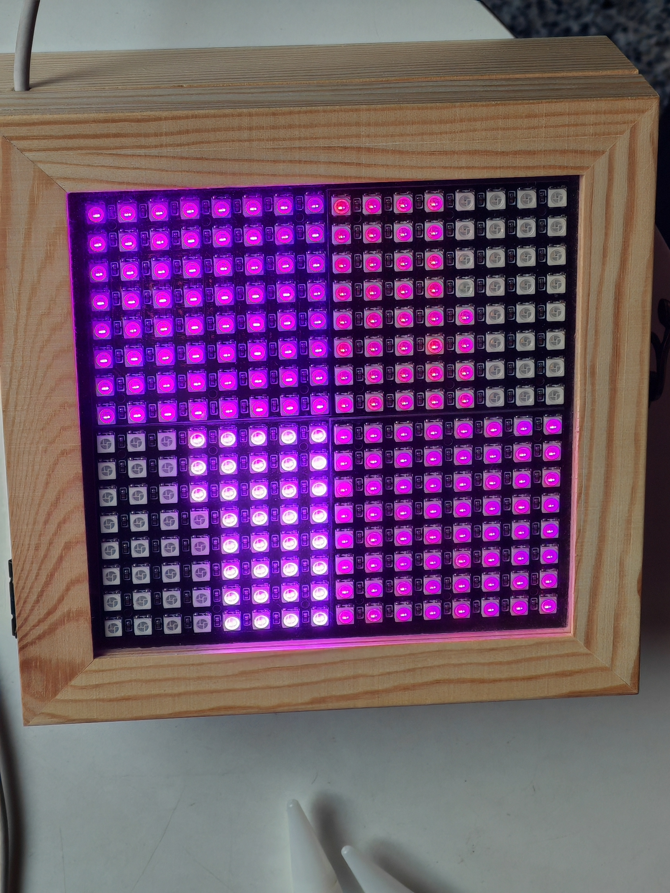
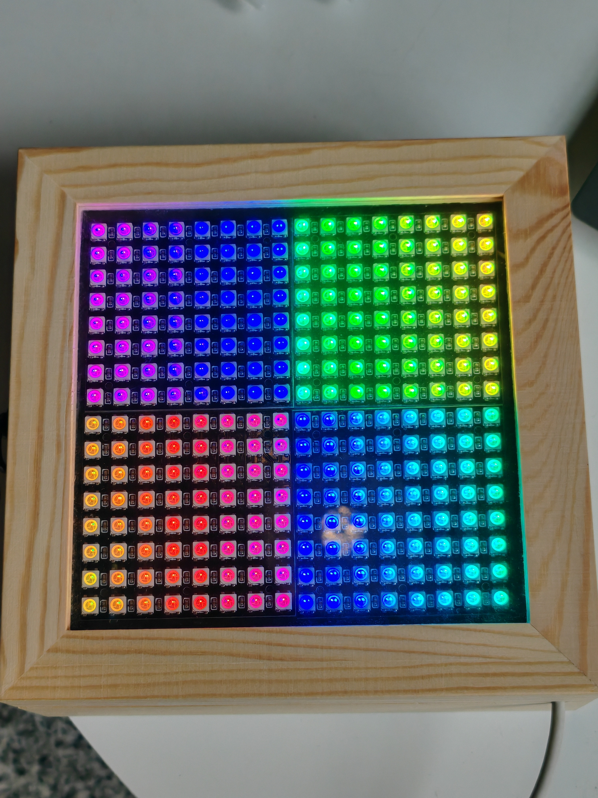
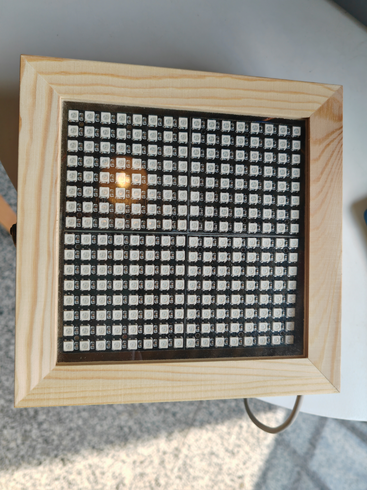
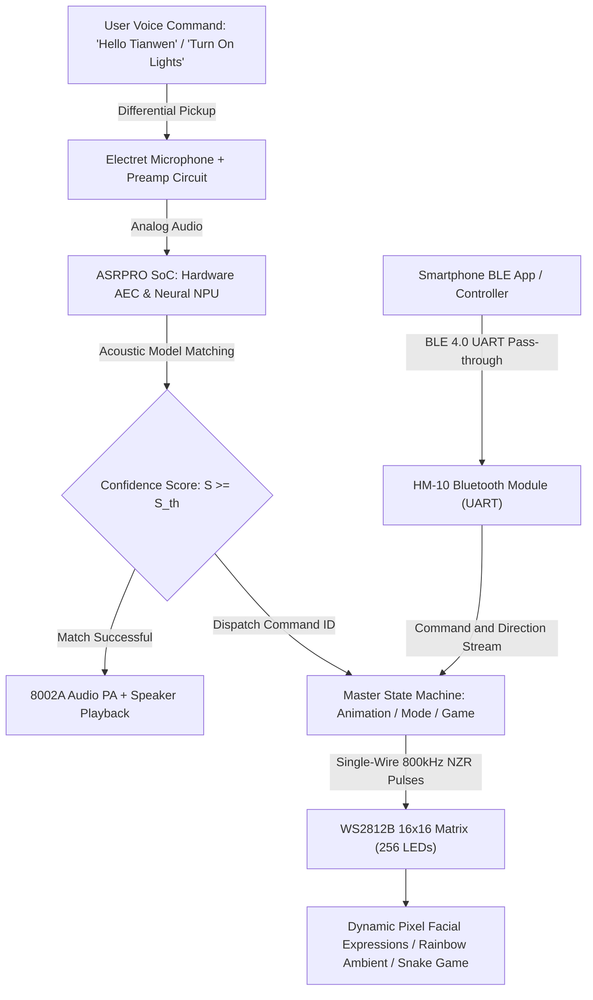
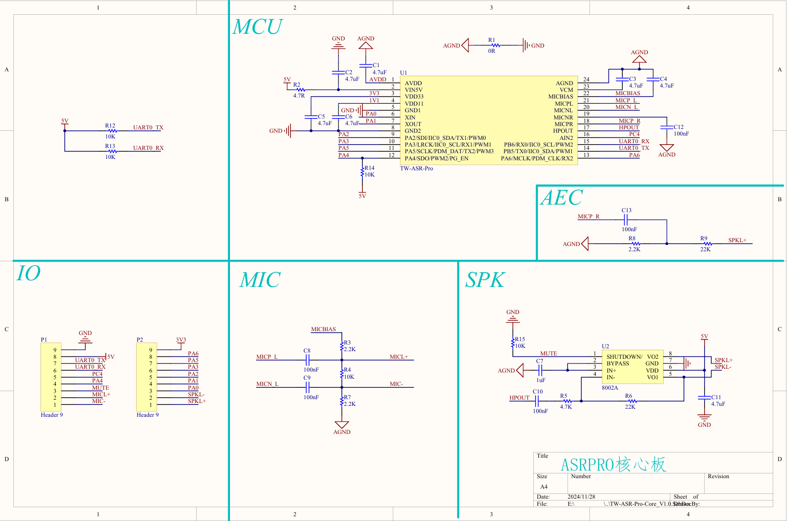
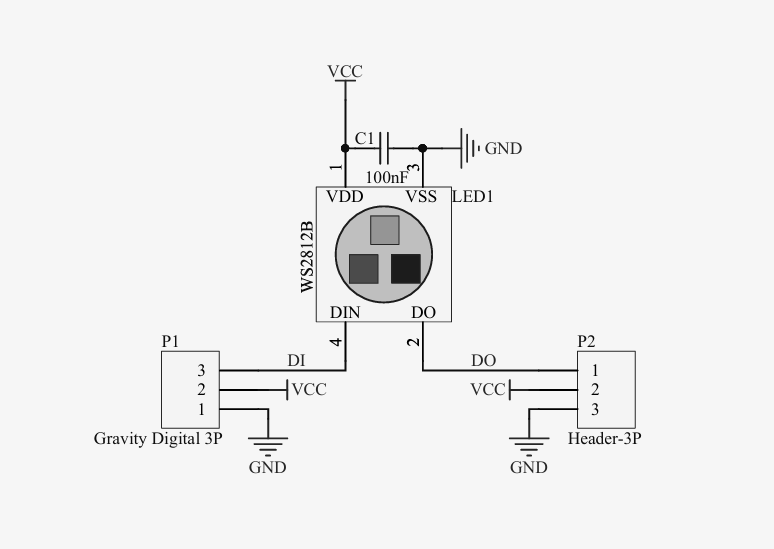
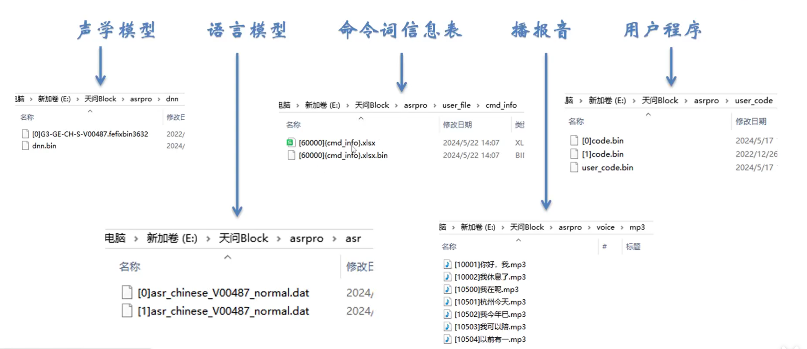
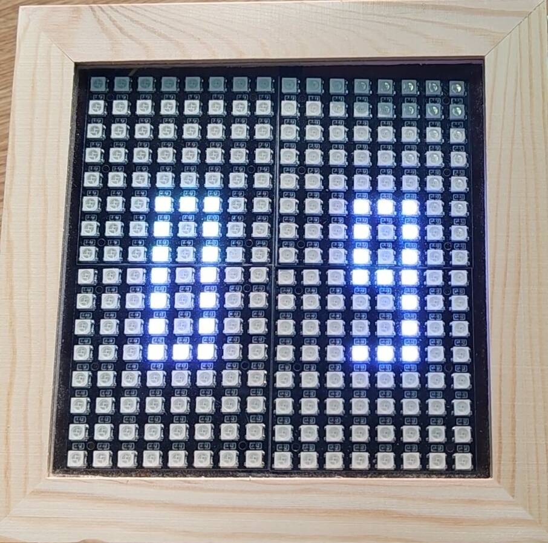

# Intelligent Lighting & Audio-Visual Interactive System Based on ASRPRO & WS2812 Matrix (Basic Level)
# 基于 ASRPRO 与 WS2812 矩阵的智能离线语音灯光音乐交互系统（初阶）

<div align="center">

[](LICENSE)
[](https://www.twen51.com/)
[](https://www.world-semi.com/)
[](docs/)
[](src/)
[](https://www.bilibili.com/video/BV1Y5N4zxEPX)
[](https://www.uestc.edu.cn/)

[**中文文档**](README.md) | [**English**](README_EN.md) | [**日本語**](README_JA.md)

</div>

---

## 1. Academic Heritage & Project Background

This project is an outstanding engineering capstone deliverable from the **"Comprehensive Curriculum Design (Basic Level)"** at the **School of Automation Engineering, University of Electronic Science and Technology of China (UESTC)**.

In modern smart home ecosystems and ambient human-computer interaction (HCI), conventional lighting systems remain constrained to mechanical toggle switches or delayed mobile smartphone app operations. These existing architectures suffer from **one-dimensional interaction, a lack of affective emotional responsiveness, complete failure under network disconnection, and rigid illumination behavior**.

To tackle these challenges, this project engineered a self-contained, highly integrated **Offline AI Voice & 16×16 WS2812B RGB Matrix Intelligent Audio-Visual Interactive System**:
- **Edge Offline AI Voice Engine**: Centered on the **ASRPRO SoC** (Tianwen 51 architecture / Neural Processing Unit NPU), incorporating hardware Acoustic Echo Cancellation (AEC) and noise suppression. It executes sub-200ms spoken command parsing locally without Internet connectivity (≥ 98% recognition accuracy in quiet environments, > 90% in typical ambient noise);
- **High-Density Full-Color Optical Matrix**: Four $8 \times 8$ WS2812B smart RGB modules are seamlessly cascaded into a **16×16 matrix (256 individual RGB pixels)**, rendering 24-bit true color (16.77 million colors) via single-line 800kHz Non-Return-to-Zero (NZR) pulses;
- **Handcrafted Wooden Enclosure & Multi-Modal Interaction**: Integrated inside a natural solid-wood picture frame with an acrylic diffuser, supporting emotional facial animations (smiling greeting, weeping sorrow), 4-quadrant rainbow color flow, Bluetooth Low Energy (HM-10 BLE 4.0) wireless control, and an interactive Snake arcade game;
- **Hardware-Software Co-Design Pipeline**: Dual-track software architecture supporting both visual block-based programming via Tianwen Block (TWenBlock) and bare-metal Native C++ firmware development, ensuring high system modularity and robustness.

---

## 2. Hardware & System Showcase

### 2.1 Physical Hardware Enclosure & Matrix Illumination Showcase

<div align="center">

| 16×16 Matrix Wooden Frame & Interactive Snake Game State | Affective Expression Animation (Smiling Pixel Face) |
| :---: | :---: |
|  |  |
| **Solid-Wood Frame Integration**: 4-quadrant cascaded WS2812B matrix running real-time pixel game inside natural wooden case | **Affective Expression Rendering**: 16×16 grid rendering high-contrast purple/white animated facial emotions |

| Four-Quadrant Rainbow Color Flow | Matrix Layout & Internal Soldering Close-Up |
| :---: | :---: |
|  |  |
| **Dynamic Ambient Rhythm**: Smooth blue-purple, emerald, fiery orange, and cyan gradient flow | **Craftsmanship & Wiring**: Industrial 3M thermal tape fixation, 2.54mm pin header soldering, and organized wiring |

</div>

* The complete live demonstration video with offline voice interaction is available on Bilibili:  
  👉 **[Watch Live Demo on Bilibili: Intelligent Lighting & Audio-Visual Interactive System Based on ASRPRO](https://www.bilibili.com/video/BV1Y5N4zxEPX)**  
  *(Demonstrating ASRPRO offline voice wake-up, 16×16 RGB dynamic color gradients, emotional facial expressions, interactive Snake game, and BLE mobile control)*

### 2.2 System Architecture & End-to-End Data Flow

The platform constitutes a closed-loop pipeline spanning acoustic input, neural speech parsing, matrix graphics rendering, and BLE control:



1. **Acoustic Frontend & Conditioning**: High-sensitivity electret microphone captures voice inputs with analog pre-filtering and differential biasing into the on-chip 16-bit ADC;
2. **Edge Speech Intelligence**: Onboard NPU extracts Mel-Frequency Cepstral Coefficients (MFCC) and performs template scoring. Upon successful classification, the speech synthesizer drives the 8002A amplifier to broadcast spoken responses;
3. **Graphics & Matrix Animation Engine**: Converts $16 \times 16$ bitmap glyphs across serpentine physical topology, supporting coordinate transformations and frame refresh rates exceeding 100 Hz;
4. **Wireless BLE Interaction**: The HM-10 module receives BLE packets from mobile phones, allowing color tuning, brightness control, and directional control for the retro Snake arcade game.

---

## 3. Hardware Circuit Design & Interconnect Topology

<div align="center">

| ASRPRO Official Core Board Schematic (MCU + MIC + SPK + AEC) | WS2812B Cascading & Decoupling Circuit Diagram |
| :---: | :---: |
|  |  |
| **ASRPRO Core Architecture**: TW-ASR-Pro processor, Acoustic Echo Cancellation (AEC), differential MIC bias, and 8002A PA | **WS2812B Cascading Protocol**: Single-wire signal propagated from DIN to DOUT with dedicated 100nF decoupling capacitors |

</div>

### 3.1 ASRPRO Core Hardware Architecture

The core board is engineered around the high-efficiency ASRPRO SoC:
- **Processor Core**: Integrated Tianwen 51 core running alongside a 32-bit DSP neural coprocessor, supported by high-capacity SPI Flash storing vocabulary models and TTS wave tables;
- **Microphone Preamplifier Circuit (MIC)**: Leverages a low-noise voltage reference `MICBIAS` with capacitors $C_8, C_9$ ($0.1\,\mu\text{F}$) and resistors $R_3, R_4, R_7$ ($2.2\,\text{k}\Omega$ / $10\,\text{k}\Omega$) forming a balanced differential input topology to reject power supply common-mode noise;
- **Audio Power Amplifier Subsystem (SPK)**: Features the **8002A** class-AB audio power amplifier (SOP-8), delivering 3W output into a $3\,\Omega$ speaker at 5V with less than 10% THD;
- **Acoustic Echo Cancellation (AEC)**: Speaker positive terminal `SPKL+` is coupled via $C_{13}$ ($100\,\text{nF}$) and attenuator network $R_8, R_9$ back to `MICP_R`, actively canceling local playback audio so users can interrupt speech during active voice prompts.

### 3.2 WS2812B 16×16 Cascaded Matrix Engineering

- **Physical Cascading**: Assembled from four $8 \times 8$ rigid PCB panels in a $2 \times 2$ quadrant arrangement;
- **Serial Signal Propagation**:
  - Main signal line originates from ASRPRO digital pin `PA_2` into Panel 1 `DIN`;
  - Panel 1 `DOUT` bridges directly to Panel 2 `DIN`, continuing sequentially through Panel 4 to form a 256-pixel continuous shift chain;
- **Power Integrity & IR-Drop Compensation**: Total theoretical peak current at full white ($R=G=B=255$) reaches:
  
  $$
  I_{\text{peak}} = 256 \times (20\,\text{mA} \times 3) = 15.36\,\text{A}
  $$
  
  To eliminate chromatic distortion and brownout resets caused by trace resistance, maximum global brightness is clamped in firmware between 20% ~ 30% (average load < 1.5A), supplemented by a $1000\,\mu\text{F}$ low-ESR electrolytic capacitor across the primary 5V rail.

### 3.3 Wireless BLE 4.0 Subsystem (HM-10)

- **RF Specifications**: Based on the TI CC2541 BLE 4.0 transceiver operating in the 2.4GHz ISM band with GFSK modulation;
- **UART Interface**: Connects to the host controller UART at 9600 bps / 115200 bps. Mobile apps transmit single-byte control payloads (e.g., `'E'` launches the Snake game, `'W'` triggers the smiling face, `'R'`/`'G'`/`'B'` sets solid colors).

---

## 4. Mathematical Formulations & Driver Algorithms

### 4.1 WS2812B Single-Wire Non-Return-to-Zero (NZR) Timing Equations

WS2812B communication relies on nanosecond-accurate single-wire NZR pulses with nominal bit cycle $T_{\text{bit}} = 1.25\,\mu\text{s} \pm 150\,\text{ns}$:
- **Logic 0 Code**: High time $T_{0\text{H}} = 400\,\text{ns} \pm 150\,\text{ns}$, Low time $T_{0\text{L}} = 850\,\text{ns} \pm 150\,\text{ns}$;
- **Logic 1 Code**: High time $T_{1\text{H}} = 850\,\text{ns} \pm 150\,\text{ns}$, Low time $T_{1\text{L}} = 400\,\text{ns} \pm 150\,\text{ns}$;
- **Latch Reset Pulse**: Low holding duration $T_{\text{reset}} > 50\,\mu\text{s}$ (firmware standard: $280\,\mu\text{s}$).

Each LED consumes 24 bits transmitted **MSB first** in **G-R-B** sequence:

$$
\mathbf{C} = [G_7, G_6, \dots, G_0, R_7, R_6, \dots, R_0, B_7, B_6, \dots, B_0] \in \{0, 1\}^{24}
$$

For $N = 256$ cascaded LEDs, total transmission time per frame is:

$$
T_{\text{frame}} = N \cdot 24 \cdot T_{\text{bit}} + T_{\text{reset}} = 256 \times 24 \times 1.25\,\mu\text{s} + 280\,\mu\text{s} = 7.68\,\text{ms} + 0.28\,\text{ms} = 7.96\,\text{ms}
$$

The theoretical maximum refresh rate without image tearing is:

$$
f_{\text{refresh, max}} = \frac{1}{T_{\text{frame}}} = \frac{1}{7.96 \times 10^{-3}\,\text{s}} \approx 125.6\,\text{Hz}
$$

This frame rate significantly surpasses the persistence-of-vision limit (24Hz), ensuring flicker-free fluid animations.

### 4.2 16×16 Matrix Serpentine Coordinate Transformation

Let 2D Cartesian screen coordinates be $(x, y)$ with $x \in [0, 15]$ (left to right) and $y \in [0, 15]$ (top to bottom).

Because physical board routing alternates direction on adjacent rows to minimize trace length (Serpentine routing), the mapping from 2D coordinates $(x, y)$ to linear buffer index $\text{Index} \in [0, 255]$ satisfies:

$$
\text{Index}(x, y) = 
\begin{cases} 
16y + x, & (y \bmod 2 = 0) \\
16y + (15 - x), & (y \bmod 2 = 1)
\end{cases}
$$

For bitmap rendering, let row glyph vector be $\mathbf{W}_y = [b_{15}, b_{14}, \dots, b_0]$. The pixel state is determined by:

$$
\text{PixelColor}(x, y) = 
\begin{cases} 
(R, G, B), & ((W_y \gg (15 - x)) \land 1) = 1 \\
(0, 0, 0), & ((W_y \gg (15 - x)) \land 1) = 0
\end{cases}
$$

### 4.3 Offline Speech Acoustic Feature Extraction & Maximum A Posteriori (MAP) Matching

The ASRPRO neural coprocessor executes on-device Hidden Markov Model & Deep Neural Network (HMM-DNN) inference:
1. **Framing & Windowing**: Sample rate $f_s = 16\,\text{kHz}$, frame length $25\,\text{ms}$, frame hop $10\,\text{ms}$, windowed with a Hamming window;
2. **Mel-Frequency Cepstral Coefficients (MFCC)**: 24-channel triangular Mel filterbank convolution followed by Discrete Cosine Transform (DCT), deriving 13 static MFCCs plus velocity ($\Delta$) and acceleration ($\Delta\Delta$) components to build a 39-dimensional acoustic feature vector $\mathbf{O} = [\mathbf{o}_1, \dots, \mathbf{o}_T]$;
3. **Maximum A Posteriori (MAP) Classification**:

$$
\hat{W} = \operatorname*{arg\,max}_{W \in \mathcal{W}} P(W \mid \mathbf{O}) = \operatorname*{arg\,max}_{W \in \mathcal{W}} \left[ \ln P(\mathbf{O} \mid W) + \lambda \ln P(W) \right]
$$

When confidence score $S(\hat{W}) \ge 0.85$, the engine validates recognition and triggers the corresponding command ID.

---

## 5. Software Engineering & Tianwen Block / C++ Architecture

The codebase supports dual-track development: visual Tianwen Block (TWenBlock) graphical assembling alongside low-level native C/C++ firmware.

<div align="center">

| Tianwen Block Offline Voice Vocabulary Configuration | 16×16 Matrix Pixel Glyph Generator |
| :---: | :---: |
|  |  |
| **Graphical Speech Setup**: Visual configuration of wake words, recognition keywords, and TTS playback phrases | **Matrix Pattern Designer**: Interactive 16×16 pixel grid editor generating compact uint16 hex glyph arrays |

</div>

- **Tianwen Block Environment**: Enables rapid block-based composition of voice callbacks, LED animations, and delays, compiling automatically into optimized firmware written over Type-C USB;
- **Native C/C++ Finite State Machine**: High-performance animation dispatching implemented in [`src/asrpro_firmware/main_asrpro_ws2812.cpp`](src/asrpro_firmware/main_asrpro_ws2812.cpp):
  ```cpp
  // Core ASR callback finite state machine
  void ASR_CODE() {
    switch (snid) {
      case 0: displaySpeakingAnimation(); break; // Wakeup: Animated mouth talking
      case 1: displaySmileyAnimation();   break; // Command 1: Render dynamic smile
      case 2: displaycryAnimation();      break; // Command 2: Render weeping crying face
      case 3: displaySmileyAnimation();   break; // Command 3: Musical smile rhythm
      case 4:                                   // Command 4: Turn off lights / Standby
        ASR_WS2812_2.pixel_set_all_color(0, 0, 0);
        ASR_WS2812_2.pixel_show();
        break;
    }
  }
  ```

---

## 6. System Technical Specifications Comparison

| Subsystem Dimension | Hardware Component / Architecture | Detailed Specifications & Metrics |
| :--- | :--- | :--- |
| **Master Processor (MCU)** | Tianwen 51 ASRPRO (TW-ASR-Pro) | AI Voice SoC with integrated neural inference coprocessor @ 240MHz |
| **Speech Recognition Engine** | On-chip Acoustic Model (NPU) | Up to 150 offline command phrases, ≥ 98% accuracy in quiet rooms, < 0.2s latency |
| **Acoustic Frontend & Audio** | Differential Electret Mic + 8002A PA | Hardware AEC, 3W class-AB power amplifier, 8-level dynamic digital volume |
| **Full-Color LED Matrix** | WS2812B-V5 Smart RGB LEDs | Four $8 \times 8$ panels forming $16 \times 16$ (256 pixels), 24-bit color, refresh rate > 120Hz |
| **Wireless Connectivity** | HM-10 BLE 4.0 Bluetooth Slave | 2.4GHz ISM band, > 10m line-of-sight range, end-to-end latency < 50ms |
| **Physical Enclosure** | Natural Solid Wood + Acrylic Panel | Dimensions ≈ 150 × 150 × 40 mm, 3M thermal adhesive matrix mounting |
| **Power Supply** | DC 5V External Regulated Supply | Reverse-polarity protected, operating current 0.2A ~ 2.0A (brightness clamped) |
| **Toolchain & Software** | Tianwen Block (TWenBlock) / GCC | Block-based visual workflow and native C/C++ firmware compilation/flashing via USB |

---

## 7. Repository Layout & File Manifest

```text
Intelligent-Lighting-Control-System-Basic/
├── docs/
│   └── images/
│       ├── demo_hardware_enclosure_active.jpg      # Active wooden frame illumination and game photo (4064x3048)
│       ├── demo_led_matrix_smile_face.jpg          # High-contrast purple/white smile face capture (2448x3264)
│       ├── demo_hardware_wood_case.jpg             # Four-quadrant rainbow flow ambient capture (3048x4064)
│       ├── demo_hardware_matrix_glow.jpg           # LED matrix glow and internal wiring detail
│       ├── demo_hardware_internal_wiring.jpg       # Matrix rear wiring and insulation craftsmanship
│       ├── hardware_asrpro_schematic.png           # Complete official ASRPRO core board schematic
│       ├── hardware_ws2812_cascade_schematic.png   # WS2812B single-wire cascade and decoupling schematic
│       ├── hardware_asrpro_module.jpg              # ASRPRO hardware core module photograph
│       ├── software_tianwen_block_voice_config.png # Tianwen Block voice command graphical setup screen
│       ├── software_matrix_pattern_design.png      # 16x16 pixel glyph designer and bitmask generator
│       └── software_bluetooth_control_app.png      # Mobile Bluetooth control app interface
├── src/
│   └── asrpro_firmware/
│       ├── main_asrpro_ws2812.cpp                  # ASRPRO native C++ firmware (ASR callbacks + WS2812 engine)
│       └── tianwen_block_projects/
│           ├── 最终版本.hd                         # Full Tianwen Block basic capstone project file
│           ├── 贪吃蛇.hd                           # 16x16 matrix interactive Snake game project
│           ├── 蓝牙点灯.hd                         # HM-10 Bluetooth wireless control project
│           ├── RGB.hd                              # Full-color space smooth gradient algorithm project
│           ├── 功能二.hd                           # Mode 2 function project
│           └── 功能三.hd                           # Mode 3 function project
├── LICENSE                                         # MIT Official Open-Source License
├── README.md                                       # Chinese Technical Specification & Derivations
├── README_EN.md                                    # English Comprehensive Engineering Specification
└── README_JA.md                                    # Japanese Technical Specification & Portfolio
```

---

## 8. Quick Start Guide

### 8.1 Hardware Pin Connections

| ASRPRO Pin | External Module / Connection Target | Electrical Function |
| :---: | :---: | :---: |
| **5V** | WS2812B Matrix V+ / Bluetooth VCC | DC 5V System Power Bus |
| **GND** | WS2812B Matrix V- / Bluetooth GND | Power Ground Reference |
| **PA_2** | WS2812B Panel 1 `DIN` | Single-Wire 800kHz NZR Data Drive |
| **TXD (UART0_TX)** | HM-10 Bluetooth `RXD` | Asynchronous Serial Transmit (9600 baud) |
| **RXD (UART0_RX)** | HM-10 Bluetooth `TXD` | Asynchronous Serial Receive |
| **SPKL+ / SPKL-** | 8Ω 2W Miniature Speaker | 8002A Differential Bridge Audio Output |
| **MICL+ / MIC-** | Electret Microphone Element | Differential Audio Sensing Input |

### 8.2 Toolchain Setup & Tianwen Block Compilation

1. Download and install **Tianwen Block 2025 (TWenBlock)**;
2. Launch Tianwen Block, click "Open Project" in the upper right, and import [`src/asrpro_firmware/tianwen_block_projects/最终版本.hd`](src/asrpro_firmware/tianwen_block_projects/最终版本.hd);
3. Connect the ASRPRO core board to your PC via a Type-C USB cable;
4. Select the target board `ASRPRO-Core` and choose the corresponding CH340 COM port;
5. Click **"Compile Firmware"** to generate machine code, bitmasks, and C++ source files;
6. Click **"Download"** to flash the binary into the onboard Flash memory via USB ISP.

### 8.3 Operation & Command Reference

1. **Wake Up System**: Say the default wake phrase **"Hello Tianwen"**;
   - Speaker announces: *"I'm here, master"* (在呢，主人);
   - The matrix renders an animated mouth talking pattern;
2. **Expression Commands**:
   - Say **"Display Smile"** (显示笑脸): The screen renders a smiling dynamic expression in purple/white;
   - Say **"Don't Cry"** (不要哭): The matrix displays weeping tears accompanied by soothing voice audio;
3. **Lighting Rhythm & Ambient Modes**:
   - Say **"Turn On Lights"** (打开灯光): The matrix transitions into a 4-quadrant rainbow gradient flow;
   - Say **"Turn Off Lights"** (关闭灯光): All LEDs extinguish, putting the system into standby;
4. **Bluetooth Control & Snake Game**:
   - Open a mobile BLE serial app (e.g., *BLE SPP* or *Blinker*) and pair with `HM-10`;
   - Send character `'E'` to initiate the Snake arcade game, steering the snake across the matrix with directional buttons.

---

## 9. Academic Credits & Acknowledgments

- **Development Team**: 2023 Undergraduate Cohort, School of Automation Engineering, University of Electronic Science and Technology of China (UESTC);
  - Core Members: Student IDs 2023060904025 (Haoran Liu), 2023060909014, et al.;
- **Advising Faculty**: Comprehensive Curriculum Design Teaching Team, School of Automation Engineering, UESTC;
- **Open-Source Acknowledgments**: Special gratitude to the Tianwen 51 (TWen51) developer community for technical support on the ASRPRO speech SDK.

---

## 10. Open-Source License

All firmware, project files, and technical documentation in this repository are released under the **MIT License**. For terms, refer to the [LICENSE](LICENSE) file.
