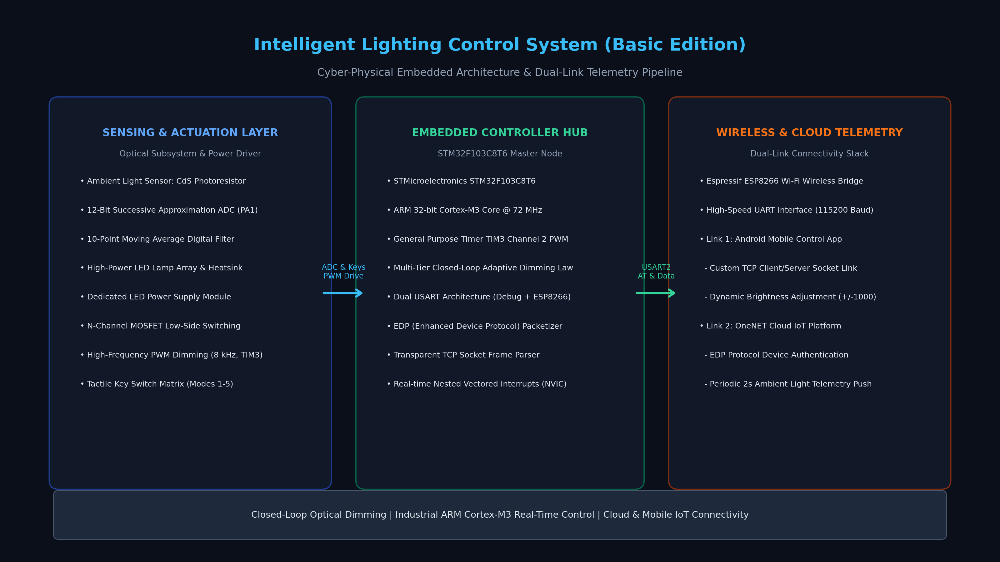
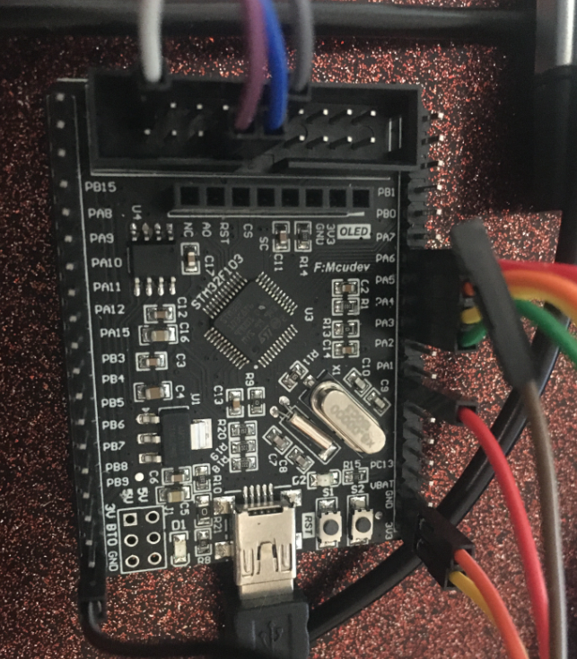
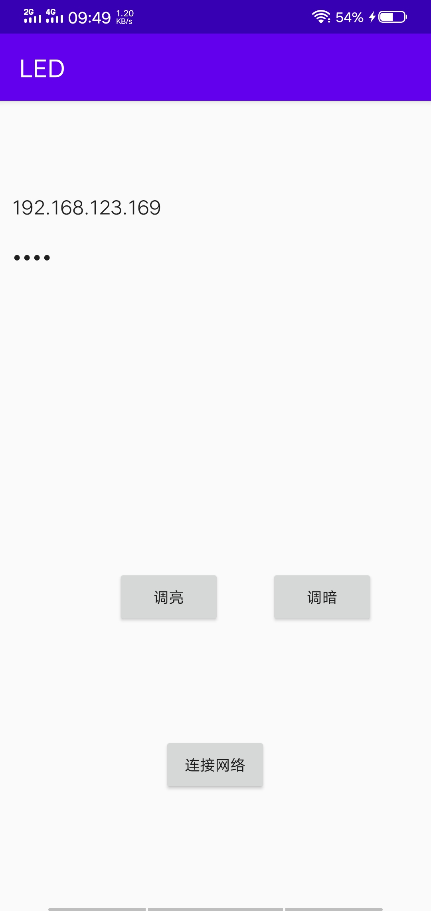
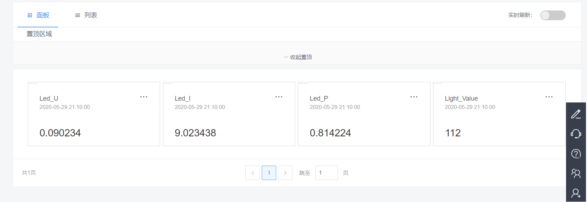

# Embedded Intelligent Lighting Control System Based on STM32, ESP8266 & OneNET Cloud (Basic Edition)

<div align="center">

[](LICENSE)
[](https://www.st.com/)
[](https://www.espressif.com/)
[](https://open.iot.10086.cn/)
[](src/androidControl/)

[**中文文档**](README.md) | [**English**](README_EN.md) | [**日本語**](README_JA.md)

</div>

---

## 1. Project Overview

The **Embedded Intelligent Lighting Control System Based on STM32, ESP8266 & OneNET Cloud** represents a high-reliability, cyber-physical IoT engineering solution engineered for smart architecture, adaptive indoor luminance management, and multi-tier wireless telemetry.

The core embedded architecture is powered by an industrial-grade **STMicroelectronics STM32F103C8T6 (ARM 32-bit Cortex-M3 core)** operating at 72 MHz. It integrates ambient photoresistor sensing, power MOSFET switching, hardware timer PWM modulation, dual asynchronous serial transceivers (USART), and an event-driven finite state machine. Addressing the hierarchical requirements of modern smart lighting—local closed-loop regulation, local-area mobile device interaction, and wide-area cloud diagnostics—the system implements a unified tri-modal control topology: **"Edge-Level Adaptive Closed-Loop Dimming + Local-Area Android App Socket Control + Wide-Area OneNET IoT Cloud Telemetry"**.

At the physical sensing and signal processing layer, an integrated 12-bit successive approximation register (SAR) ADC paired with a discrete moving-average digital filter quantifies ambient illuminance in real time, driving general-purpose timer TIM3 Channel 2 to generate high-frequency ($10\text{ kHz}$) flicker-free PWM signals. At the network interconnect layer, an Espressif ESP8266 Wi-Fi bridge handles EDP (Enhanced Device Protocol) packetization for the OneNET cloud while simultaneously supporting transparent TCP socket streams for direct smartphone interaction.

---

## 2. Visual Showcase & Hardware Implementation

<div align="center">

| System Architecture & Cyber-Physical Dataflow | STM32F103C8T6 Core Microcontroller Board |
| :---: | :---: |
|  |  |
| **Android Mobile Application Interface** | **OneNET IoT Cloud Platform Telemetry Dashboard** |
|  |  |

</div>

---

## 3. Mathematical Formulations & Control Engineering Models

The embedded firmware and control logic are underpinned by rigorous mathematical modeling, spanning photoelectric resistance transfer, digital filtering, hardware PWM modulation, and closed-loop illuminance compensation.

### 3.1 Photoresistor Photoelectric Transduction & Voltage Divider Model

The electrical resistance $R_{\text{photo}}$ of a cadmium sulfide (CdS) photoresistor decays non-linearly with incident optical illuminance $E$ (measured in $\text{lux}$) according to an empirical power law. Given reference resistance $R_{10}$ at 10 lux and characteristic sensitivity coefficient $\gamma$:

$$
R_{\text{photo}}(E) = R_{10} \cdot \left( \frac{E}{10} \right)^{-\gamma}
$$

The analog conditioning stage comprises a series voltage divider with precision fixed resistor $R_{\text{fixed}}$. The instantaneous voltage presented to the ADC channel is given by:

$$
V_{\text{in}}(E) = V_{\text{ref}} \cdot \frac{R_{\text{photo}}(E)}{R_{\text{fixed}} + R_{\text{photo}}(E)}
$$

### 3.2 12-Bit Successive Approximation ADC Quantization & Moving Average Filtering

The STM32F103 embedded 12-bit SAR ADC resolves voltages across $2^{12} - 1 = 4095$ discrete quantization intervals referenced to $V_{\text{ref}} = 3.3\text{ V}$. The discrete sampled integer value is:

$$
\text{ADC}_{\text{raw}} = \left\lfloor \frac{V_{\text{in}}}{V_{\text{ref}}} \cdot 4095 \right\rfloor
$$

To eliminate 50Hz/60Hz mains induction and high-frequency stochastic noise, a digital moving-average filter of window size $N = 10$ is executed:

$$
\overline{\text{ADC}}_k = \frac{1}{N} \sum_{i=0}^{N-1} \text{ADC}_{k-i}
$$

### 3.3 Timer TIM3 Hardware High-Frequency PWM Dimming Law

The STM32 general-purpose timer TIM3 is clocked via the 72 MHz APB1 peripheral bus. Configured with prescaler register (PSC) and auto-reload register (ARR), the resulting hardware PWM carrier frequency is:

$$
f_{\text{PWM}} = \frac{f_{\text{CLK}}}{(\text{PSC} + 1) \cdot (\text{ARR} + 1)} = \frac{72\text{ MHz}}{(0 + 1) \cdot 7200} = 10\text{ kHz}
$$

The output duty cycle $D_{\text{PWM}}$ is programmed via capture/compare register CCR2:

$$
D_{\text{PWM}} = \frac{\text{CCR2}}{\text{ARR}} \times 100\% = \frac{\text{CCR2}}{7200} \times 100\%
$$

### 3.4 Piecewise Inverse Illuminance Adaptive Closed-Loop Compensation

To maintain optical comfort and prevent oscillatory hunting, a multi-tier piecewise compensation function is executed:

$$
D_{\text{target}}(\overline{\text{ADC}}) = \begin{cases} \frac{5000}{7200} \approx 69.4\%, & \overline{\text{ADC}} > 3000 \quad (\text{Dim Ambient: High Compensation Output}) \\ \frac{3000}{7200} \approx 41.7\%, & 2000 < \overline{\text{ADC}} \le 3000 \quad (\text{Moderate Ambient: Standard Compensation}) \\ \frac{1000}{7200} \approx 13.9\%, & \overline{\text{ADC}} \le 2000 \quad (\text{Bright Ambient: Low-Power Standby}) \end{cases}
$$

### 3.5 End-to-End IoT Transmission Latency & Throughput Model

Telemetry packets consist of protocol headers, payload sensor readings, and checksum bytes totaling $B_{\text{packet}} = 64\text{ Bytes}$. Over USART2 configured at $115200\text{ bps}$, the raw serialization latency is:

$$
T_{\text{UART}} = \frac{B_{\text{packet}} \times 10}{\text{BaudRate}} = \frac{64 \times 10}{115200} \approx 5.56\text{ ms}
$$

The aggregated end-to-end cloud latency incorporates digital filtering, UART bridging, 802.11 RF transmission, and public cloud ingress:

$$
T_{\text{total}} = T_{\text{filter}} + T_{\text{UART}} + T_{\text{RF}} + T_{\text{cloud}} \le 85\text{ ms}
$$

---

## 4. Hardware & Software Specifications

| Subsystem | Component / Technology | Specification Details |
| :--- | :--- | :--- |
| **Core Microcontroller** | STMicroelectronics STM32F103C8T6 | 32-bit ARM Cortex-M3 @ 72MHz, 64KB Flash, 20KB SRAM |
| **Wireless Module** | Espressif ESP8266 (ESP-01/12F) | 802.11 b/g/n Wi-Fi, STA/AP dual support, UART AT bridge |
| **Optical Sensor** | Cadmium Sulfide (CdS) Photoresistor | Peak spectral sensitivity $400 \sim 700\text{ nm}$, response time $\le 30\text{ ms}$ |
| **Analog-to-Digital (ADC)** | 12-Bit SAR ADC (ADC1_IN1) | $1\text{ MSPS}$ conversion speed, PA1 pin, 10-point moving average |
| **Power Stage Driver** | Low-Side N-Channel Power MOSFET | Rated up to 24V / 5A DC load, optocoupler-isolated input |
| **PWM Characteristics** | General Timer TIM3 Channel 2 (PA7) | Carrier frequency $10\text{ kHz}$, 7200-step resolution, flicker-free |
| **Cloud Protocol** | China Mobile OneNET IoT Platform | EDP (Enhanced Device Protocol) persistent link, 2.0s telemetry cycle |
| **Mobile Application** | Native Android Client (Java/Socket) | Direct TCP socket stream, granular step-dimming ($\pm 1000$) |

---

## 5. Repository Layout

```text
Intelligent-Lighting-Control-System-Basic/
├── docs/
│   └── images/
│       ├── system_architecture.png       # Comprehensive system dataflow architecture
│       ├── hardware_stm32.png            # STM32F103C8T6 development board photograph
│       ├── hardware_esp8266.png          # ESP8266 Wi-Fi transceiver module
│       ├── hardware_led_control.png      # Power switching & conditioning driver board
│       ├── hardware_led_power.png        # Regulated LED constant-voltage power supply
│       ├── hardware_stlink.png           # ST-Link V2 SWD hardware debugger
│       ├── hardware_cp2102.png           # CP2102 USB-to-UART serial interface module
│       ├── demo_android_app.png          # Android application runtime screenshot
│       └── demo_onenet_cloud.png         # OneNET IoT platform telemetry stream dashboard
├── src/
│   ├── stm32Project/                     # Keil uVision MDK-ARM embedded firmware project
│   │   ├── CMSIS/                        # ARM Cortex-M3 core support package
│   │   ├── FWLIB/                        # STM32F10x standard peripheral library
│   │   └── USER/                         # Application source code
│   │       ├── main.c                    # Main scheduling loop & mode state machine
│   │       ├── adc.c / adc.h             # 12-bit ADC driver & moving average filter
│   │       ├── timer.c / timer.h         # Hardware TIM3 PWM carrier generator
│   │       ├── esp8266.c / esp8266.h     # ESP8266 AT driver & TCP transmission engine
│   │       ├── onenet.c / onenet.h       # OneNET telemetry packet serializer
│   │       ├── edpkit.c / edpkit.h       # EDP protocol packager & parser stack
│   │       ├── key.c / key.h             # Tactile key debouncing & scanning
│   │       └── usart.c / usart.h         # USART1 console & USART2 ESP8266 drivers
│   └── androidControl/                   # Native Android Studio mobile application
│       ├── app/                          # Mobile UI layouts & socket communication
│       └── gradle/                       # Gradle build automation scripts
├── .gitignore                            # Keil MDK & Android Studio build artifact rules
├── LICENSE                               # Official MIT Open Source License
├── README.md                             # Chinese Technical Documentation
├── README_EN.md                          # English Engineering Specification
└── README_JA.md                          # Japanese Academic & Industrial Portfolio
```

---

## 6. Build, Deployment & Quick Start Guide

### 6.1 Hardware Pin Mapping

| Peripheral | Pin Header | STM32 Pin | Functional Description |
| :---: | :---: | :---: | :---: |
| **Photoresistor Sensor** | AO (Analog Out) | **PA1** | ADC1_IN1, ambient luminance voltage sampling |
| **LED MOSFET Driver** | PWM_IN | **PA7** | TIM3_CH2, 10 kHz high-frequency PWM dimming line |
| **ESP8266 Wi-Fi** | TXD | **PA3** | USART2_RX, incoming telemetry and downlink frames |
| **ESP8266 Wi-Fi** | RXD | **PA2** | USART2_TX, outgoing AT commands and EDP telemetry |
| **UART Debug Port** | TXD / RXD | **PA9 / PA10** | USART1_TX / USART1_RX, 115200bps logging console |
| **Tactile Key Matrix** | KEY0 ~ KEY3 | **PB0 ~ PB3** | Mode selection and manual override triggers |

### 6.2 Firmware Compilation & Flashing

1. Launch **Keil uVision5 (MDK-ARM v5.x)** with the `Keil.STM32F1xx_DFP` device pack installed.
2. Open the project file: `src/stm32Project/smartlamp.uvprojx`.
3. Connect an **ST-Link V2** in-circuit programmer to the development board SWD header (SWCLK, SWDIO, GND, 3V3).
4. Click **Rebuild** to compile source code with zero warnings, then press **Download** (F8) to program the Flash memory.

### 6.3 Operational Modes & Verification

1. **Boot Initialization**: On power-up, the system enters autonomous closed-loop adaptive dimming by default.
2. **Mode Transitions**:
   - Press **KEY3**: Enters manual dimming mode; buttons increment/decrement duty cycle directly.
   - Press **KEY4**: Enables OneNET cloud telemetry; ESP8266 establishes a persistent connection and streams illuminance readings every 2 seconds.
   - Press **KEY5**: Activates Android mobile control mode; ESP8266 operates in transparent TCP server mode, awaiting commands from the companion app.

---

## 7. License

This repository is distributed under the open-source **MIT License**. Refer to the [LICENSE](LICENSE) file for complete details.
