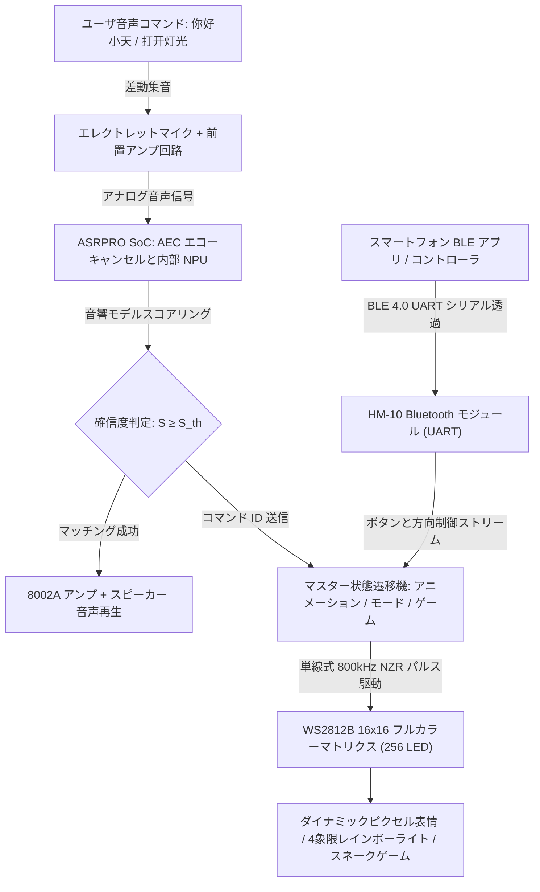

# ASRPRO と WS2812 マトリクスに基づくスマートオフライン音声照明・音響視覚対話システム（初級）
# Intelligent Lighting & Audio-Visual Interactive System Based on ASRPRO & WS2812 Matrix (Basic Level)

<div align="center">

[](LICENSE)
[](https://www.twen51.com/)
[](https://www.world-semi.com/)
[](docs/)
[](src/)
[](https://www.bilibili.com/video/BV1Y5N4zxEPX)
[](https://www.uestc.edu.cn/)

[**中文文档**](README.md) | [**English**](README_EN.md) | [**日本語**](README_JA.md)

</div>

---

## 1. 学術的背景とプロジェクト沿革 (Academic Heritage & Background)

本プロジェクトは、**電子科技大学（UESTC）自動化工程学院**の学部コア実践カリキュラム——**「総合カリキュラム設計（初級）」**における優秀なエンジニアリング成果です。

スマートホーム、エモーショナルなヒューマンマシンインターフェース（HCI）、およびデジタル音響・光アートの急速な発展に伴い、従来の照明器具は単純な機械式スイッチやスマートフォンのコールドスタート操作に依存してきました。これにより、**対話の次元が単一であり、人間味のある情動応答に欠け、ネットワーク切断時に完全停止し、光の表現力が乏しい**という課題が存在していました。

これらの課題に対処するため、本プロジェクトでは高集積・没入型の音響照明リズムとマルチモーダル対話を目指し、**ASRPROオフライン音声認識と 16×16 WS2812B フルカラーLEDマトリクスに基づくスマート音響視覚対話プラットフォーム**を開発しました：
- **エッジオフラインAI音声中枢**：**ASRPRO 高性能オフライン音声認識SoC**（天問51アーキテクチャ / ニューラルプロセッサNPU）をコアに採用し、ハードウェア音響エコーキャンセル（AEC）とノイズ低減フィルタを内蔵。クラウド不要でミリ秒クラスの即時応答を実現（静音環境での認識率 ≥ 98%、一般的ノイズ環境で 90% 以上）；
- **高密度フルカラー光マトリクス**：4枚の $8 \times 8$ WS2812B 外部制御RGBモジュールを精密にカスケード接合し、**16×16 ドットマトリクス（合計256個の独立RGBピクセル）**を構成。単線式800kHz Non-Return-to-Zero（NZR）プロトコルにより、24ビットトゥルーカラー（1677万色）の滑らかな階調表現を実現；
- **木製額縁ハードウェアと没入型インタラクション**：天然無垢材フレームとアクリル拡散板を独自設計・加工。高精度差動マイクと 8002A オーディオパワーアンプを内蔵し、エモーショナルな表情アニメーション（笑顔・泣き顔）、4象限レインボーグラデーション光、低消費電力Bluetooth（HM-10 BLE 4.0）無線リモコン、および対話型スネークゲームをサポート；
- **ハード・ソフト協調開発パイプライン**：天問Block（TWenBlock）によるビジュアルプログラミングとベアメタルNative C++ファームウェア開発のデュアルトラックをサポートし、高いモジュール性と堅牢性を確立。

---

## 2. ハードウェア実機写真とシステムアーキテクチャ (Hardware & System Showcase)

### 2.1 木製額縁実機とマトリクス発光デモ (Physical Hardware Artifacts)

<div align="center">

| 16×16 マトリクス木製額縁実機とスネークゲーム状態 | エモーショナル表情アニメーション（ピクセル笑顔）実写 |
| :---: | :---: |
|  |  |
| **無垢材額縁への統合**：4象限にカスケードされたWS2812Bマトリクス上で動作するスネークゲーム画面 | **表情レンダリング**：16×16 格子上で紫と白のハイコントラストで描画されるダイナミックな笑顔アニメーション |

| 4象限レインボーグラデーション光の展示 | マトリクス内部配線とはんだ付け工芸 |
| :---: | :---: |
|  |  |
| **4象限レインボーフロー**：青紫、エメラルド、橙赤、シアンが滑らかに遷移するアンビエントライト | **ハードウェア実装工芸**：3M熱伝導両面テープによる固定、2.54mm標準ピンヘッダの半田付けと防振配線 |

</div>

* 完全な実機動作およびオフライン音声対話デモ動画は Bilibili にて公開されています：  
  👉 **[Bilibili で実機デモ動画を視聴する：ASRPROに基づくスマートオフライン音声照明・音響視覚対話システム実機稼働全記録](https://www.bilibili.com/video/BV1Y5N4zxEPX)**  
  *(ASRPRO オフライン音声起動・コマンド認識、16×16 フルカラー点陣の動的光エフェクト・レインボーグラデーション、表情アニメーション、スネークゲーム対話、Bluetooth リモコン操作を網羅)*

### 2.2 システム全体トポロジと音響視覚データフロー (System Architecture & Data Flow)

システムは、音響集音、オフラインニューラル音声認識、マトリクス描画からBLE制御に至る閉ループ構造を形成しています：



1. **音響フロントエンド層 (Acoustic Frontend)**：高感度エレクトレットマイクが音声信号を捉え、アナログ差動バイアス回路でノイズを抑圧して16ビットADCへ供給；
2. **エッジ音声認識層 (Edge Speech AI)**：チップ内蔵のNPUがメル周波数ケプストラム係数（MFCC）を抽出し、テンプレートスコアリングを実行。認識成功時に内蔵音声合成と8002Aアンプを介して応答音声を再生；
3. **光アニメーション＆グラフィックスエンジン (Matrix Display Engine)**：16×16 ビットマップフォントライブラリと蛇行配線マッピングアルゴリズムを内蔵し、100Hz超のフレームレートで滑らかな画面更新を実現；
4. **無線Bluetooth・ゲーム対話層 (BLE & Game)**：HM-10モジュールを介してスマホからの調光指令やスネークゲームの方向指示を受信・処理。

---

## 3. ハードウェア回路設計と接続トポロジ (Hardware & Circuit Design)

<div align="center">

| ASRPRO コア基板公式回路図 (MCU + MIC + SPK + AEC) | WS2812B 単線カスケード接続とデカップリング回路図 |
| :---: | :---: |
|  |  |
| **ASRPRO コア回路**：TW-ASR-Pro プロセッサ、音響エコーキャンセル（AEC）、MICBIAS 差動バイアス、8002A アンプ | **WS2812B カスケード接続**：DIN から DOUT へ単線信号を波形整形伝送、各LEDに100nFバイパスコンデンサを配置 |

</div>

### 3.1 ASRPRO コア基板のハードウェア構成

ASRPRO コアモジュールは、オフライン音声処理に特化した高集積SoC回路を採用しています：
- **プロセッサコア**：天問51コアと32ビットDSPニューラルアクセラレータを搭載し、大容量SPI Flashに音声辞書とファームウェアを保持；
- **マイクロフォン前置増幅回路 (MIC)**：低ノイズ基準電源 `MICBIAS`、コンデンサ C8, C9（0.1 μF）、抵抗 R3, R4, R7（2.2 kΩ / 10 kΩ）による差動入力構成で同相電源ノイズを除去；
- **オーディオパワーアンプ (SPK / 8002A)**：車載・産業用小型AB級オーディオアンプ **8002A**（SOP-8）を採用し、5V 駆動、3Ω 負荷時に最大 3W（歪み率 10% 未満）の十分な音量出力を確保；
- **音響エコーキャンセル回路 (AEC)**：スピーカー正極 `SPKL+` から C13（100 nF）および分圧抵抗 R8, R9 を通じて `MICP_R` へ音声波形をフィードバックし、ガイダンス音声再生中であってもユーザーの割り込み発話を正確に検出。

### 3.2 WS2812B 16×16 マトリクス設計と電力配慮

- **物理カスケード接続**：4枚の 8×8 剛性PCBを正方形に配置；
- **シリアル信号経路**：
  - ASRPRO のデジタル端子 `PA_2` から第1パネルの `DIN` へ入力；
  - 第1パネルの `DOUT` を第2パネルの `DIN` へ直結し、第4パネルまで順次カスケードして合計256個の連続シフトレジスタチェーンを構築；
- **電力完全性とIRドロップ対策**：256個のRGB LEDが最大輝度白点灯（`R=G=B=255`）した際の理論ピーク電流は：
  
  $$
  I_{\text{peak}} = 256 \times (20\text{ mA} \times 3) = 15.36\text{ A}
  $$
  
  配線抵抗による電圧降下と色ズレを防止するため、ファームウェア側で全体輝度を 20% ~ 30%（定常平均負荷 1.5A 未満）に制限し、電源母線入力部に 1000 μF の低ESR電解コンデンサを並列接続。

### 3.3 Bluetooth 4.0 BLE 無線通信サブシステム (HM-10)

- **RF 仕様**：TI CC2541 ベースの HM-10 BLE 4.0 スレーブモジュール（2.4GHz ISM帯、GFSK変調）；
- **UART インターフェース**：主制御基板のハードウェアシリアルポートとクロス接続（ボーレート 9600 bps / 115200 bps）。スマホアプリからBLE経由で1バイトのコマンド（例：`'E'` でスネークゲーム開始、`'W'` で笑顔表示、`'R'`/`'G'`/`'B'` で単色点灯）を送信。

---

## 4. 数理モデルと駆動アルゴリズムの導出 (Mathematical Formulations)

### 4.1 WS2812B 単線式 Non-Return-to-Zero（NZR）パルス伝送方程式

WS2812B の通信プロトコルは、ナノ秒オーダーの単線式 NZR 方式に基づきます（1ビット周期 `T_bit = 1.25 μs ± 150 ns`）：
- **論理 0 符号**：High期間 `T_0H = 400 ns ± 150 ns`、Low期間 `T_0L = 850 ns ± 150 ns`；
- **論理 1 符号**：High期間 `T_1H = 850 ns ± 150 ns`、Low期間 `T_1L = 400 ns ± 150 ns`；
- **リセットパルス期間**：ローレベル保持時間 `T_reset > 50 μs`（ファームウェア標準：`280 μs`）。

各ピクセルは24ビットの色彩データを **MSBファースト** かつ **G-R-B** の順序で受信します：

$$
\mathbf{C} = [G_7, G_6, \dots, G_0, R_7, R_6, \dots, R_0, B_7, B_6, \dots, B_0] \in \{0, 1\}^{24}
$$

カスケード総数 $N = 256$ のマトリクスにおいて、1フレームの全データ送信時間は：

$$
T_{\text{frame}} = N \cdot 24 \cdot T_{\text{bit}} + T_{\text{reset}} = 256 \times 24 \times 1.25\ \mu\text{s} + 280\ \mu\text{s} = 7.68\text{ ms} + 0.28\text{ ms} = 7.96\text{ ms}
$$

理論上の最大フレームレートは次式で表されます：

$$
f_{\text{refresh, max}} = \frac{1}{T_{\text{frame}}} = \frac{1}{7.96 \times 10^{-3}\text{ s}} \approx 125.6\text{ Hz}
$$

このフレームレートは人間の臨界融合頻度（24Hz）を大幅に上回り、ちらつきのない滑らかな表示を実現します。

### 4.2 16×16 マトリクス蛇行配線空間座標変換方程式

平面ディスプレイ上の直交座標を $(x, y)$ と定義します（$x \in [0, 15]$ は左から右、$y \in [0, 15]$ は上から下）。

物理配線は配線長を最短化するため蛇行（Serpentine）反転配線を採用しているため、2次元論理座標 $(x, y)$ から1次元VRAM配列インデックス $\text{Index} \in [0, 255]$ への非線形変換は次式に従います：

$$
\text{Index}(x, y) = 
\begin{cases} 
16y + x, & (y \bmod 2 = 0) \\
16y + (15 - x), & (y \bmod 2 = 1)
\end{cases}
$$

ビットマップ描画時、行フォントベクトルを $\mathbf{W}_y = [b_{15}, b_{14}, \dots, b_0]$ とすると、各ピクセルの点灯判定は次式で行われます：

$$
\text{PixelColor}(x, y) = 
\begin{cases} 
(R, G, B), & ((W_y \gg (15 - x)) \land 1) = 1 \\
(0, 0, 0), & ((W_y \gg (15 - x)) \land 1) = 0
\end{cases}
$$

### 4.3 オフライン音声特徴量抽出とベイズ最大事後確率（MAP）推定

ASRPRO 内蔵のNPUは、エッジ環境向けに最適化された音響モデル推論を実行します：
1. **フレーム分割と窓関数**：サンプリング周波数 16 kHz、フレーム長 25 ms、フレームシフト 10 ms、ハミング窓（Hamming Window）を適用；
2. **メル周波数ケプストラム係数 (MFCC)**：DFT後のパワースペクトルに対し24チャネルのメルフィルタバンクを適用し、DCTにより13次元静的MFCCおよび1次・2次動的特徴量を算出し、39次元音響特徴ベクトル $\mathbf{O} = [\mathbf{o}_1, \dots, \mathbf{o}_T]$ を構築；
3. **最大事後確率判定**：定義済み語彙辞書 $\mathcal{W}$ から最適な単語 $\hat{W}$ を探索：

$$
\hat{W} = \arg\max_{W \in \mathcal{W}} P(W \mid \mathbf{O}) = \arg\max_{W \in \mathcal{W}} \left[ \ln P(\mathbf{O} \mid W) + \lambda \ln P(W) \right]
$$

確信度スコアが $S(\hat{W}) \ge 0.85$ を満たすとき、有効な音声認識として固有のコマンドIDをマスター状態遷移機へ発行します。

---

## 5. ソフトウェア設計と天問Block / C++ 開発環境 (Software Systems)

天問Block（TWenBlock）によるビジュアルプログラミングと、ネイティブC/C++による組み込みコーディングの両方に対応しています。

<div align="center">

| 天問Block オフライン音声認識語彙設定画面 | 16×16 マトリクス文字・パターンフォントジェネレータ |
| :---: | :---: |
|  |  |
| **ビジュアル音声設定**：ウェイクワード、認識語彙（「電気をつけて」「笑顔を出して」等）および合成音声をGUIで設定 | **ピクセルパターン設計**：16×16 格子デザイナーで直感的にビットパターンを作成し、uint16 配列へ自動変換 |

</div>

- **天問Block ビジュアル開発**：ブロックを配置するだけで、音声コールバック、LED制御、ディレイ処理を自動的にC++ソースへ変換し、Type-C USB経由でワンクリック書き込み；
- **ネイティブC/C++ コア状態遷移機**：[`src/asrpro_firmware/main_asrpro_ws2812.cpp`](src/asrpro_firmware/main_asrpro_ws2812.cpp) に完全なファームウェアを実装：
  ```cpp
  // 音声コールバック状態遷移機
  void ASR_CODE() {
    switch (snid) {
      case 0: displaySpeakingAnimation(); break; // ウェイクアップ時：口の開閉アニメーション
      case 1: displaySmileyAnimation();   break; // コマンド1: 動的笑顔を表示
      case 2: displaycryAnimation();      break; // コマンド2: 涙を流す泣き顔を表示
      case 3: displaySmileyAnimation();   break; // コマンド3: 音律に合わせた笑顔
      case 4:                                   // コマンド4: 消灯・スタンバイ
        ASR_WS2812_2.pixel_set_all_color(0, 0, 0);
        ASR_WS2812_2.pixel_show();
        break;
    }
  }
  ```

---

## 6. システム主要諸元比較表 (System Specifications)

| サブシステム項目 | 採用ハードウェア / 技術選定 | 詳細仕様および性能指標 |
| :--- | :--- | :--- |
| **主制御プロセッサ (MCU)** | 天問 51 ASRPRO (TW-ASR-Pro) | AI音声専用SoC、ニューラル推論コプロセッサ内蔵、動作周波数 240MHz |
| **オフライン音声認識** | オンチップ音響モデル (NPU) | 最大150語彙、静音時認識精度 ≥ 98%、応答遅延 < 0.2s |
| **音響フロントエンド** | 差動エレクトレットマイク＋8002Aアンプ | ハードウェアAECエコーキャンセル内蔵、3W パワーアンプ、8段階音量調節 |
| **フルカラーLEDマトリクス** | WS2812B-V5 スマートRGB LED | 8×8 パネル4枚による 16×16 構成（256個）、1677万色、リフレッシュレート > 120Hz |
| **無線通信モジュール** | HM-10 BLE 4.0 Bluetooth スレーブ | 2.4GHz ISM帯、見通し通信距離 > 10m、通信レイテンシ < 50ms |
| **外装構造** | 天然無垢材額縁＋アクリルパネル | 外形寸法 約 150 × 150 × 40 mm、3M熱伝導シートによる強固な固定 |
| **電源システム** | DC 5V 外部安定化電源 | 逆接続保護回路内蔵、動作電流 0.2A ~ 2.0A（ファームウェア輝度制限保護） |
| **開発環境とツールチェーン** | 天問Block (TWenBlock) / GCC | ビジュアルブロックプログラミングおよびネイティブC/C++ソースコードコンパイル、USB書き込み対応 |

---

## 7. リポジトリ構成とファイル一覧 (Repository Layout)

```text
Intelligent-Lighting-Control-System-Basic/
├── docs/
│   └── images/
│       ├── demo_hardware_enclosure_active.jpg      # 木製額縁実機点灯・ゲーム動作写真 (4064x3048)
│       ├── demo_led_matrix_smile_face.jpg          # 16x16 笑顔表情ハイコントラスト実写写真 (2448x3264)
│       ├── demo_hardware_wood_case.jpg             # 4象限レインボーグラデーション額縁写真 (3048x4064)
│       ├── demo_hardware_matrix_glow.jpg           # LED点灯および内部配線詳細写真
│       ├── demo_hardware_internal_wiring.jpg       # マトリクス背面配線および絶縁工芸写真
│       ├── hardware_asrpro_schematic.png           # ASRPRO 公式コア基板回路図 (MCU/MIC/SPK/AEC)
│       ├── hardware_ws2812_cascade_schematic.png   # WS2812B カスケード接続・デカップリング回路図
│       ├── hardware_asrpro_module.jpg              # ASRPRO ハードウェアモジュール外観写真
│       ├── software_tianwen_block_voice_config.png # 天問Block 音声設定GUI画面キャプチャ
│       ├── software_matrix_pattern_design.png      # 16x16 パターンビットマスク設計ツール
│       └── software_bluetooth_control_app.png      # Bluetooth スマホ操作アプリ画面
├── src/
│   └── asrpro_firmware/
│       ├── main_asrpro_ws2812.cpp                  # ASRPRO ネイティブC++ファームウェア (ASR割込+WS2812駆動)
│       └── tianwen_block_projects/
│           ├── 最终版本.hd                         # 天問Block 初級完全プロジェクトファイル
│           ├── 贪吃蛇.hd                           # 16x16 マトリクス対話型スネークゲームプロジェクト
│           ├── 蓝牙点灯.hd                         # HM-10 Bluetooth 通信制御プロジェクト
│           ├── RGB.hd                              # フルカラーカラースペースグラデーションプロジェクト
│           ├── 功能二.hd                           # モード2機能プロジェクト
│           └── 功能三.hd                           # モード3機能プロジェクト
├── LICENSE                                         # MIT 公式オープンソースライセンス
├── README.md                                       # 中国語技術仕様書・数理モデル解説
├── README_EN.md                                    # 英語総合技術仕様書
└── README_JA.md                                    # 日本語技術仕様書・学術ポートフォリオ
```

---

## 8. クイックスタートガイド (Quick Start Guide)

### 8.1 ハードウェア配線対応表

| ASRPRO 端子 | 接続先外部モジュール | 機能・信号定義 |
| :---: | :---: | :---: |
| **5V** | WS2812B V+ / Bluetooth VCC | DC 5V システム電源バス |
| **GND** | WS2812B V- / Bluetooth GND | 共通グランド |
| **PA_2** | WS2812B 第1パネル `DIN` | 単線式 800kHz NZR デジタル駆動信号 |
| **TXD (UART0_TX)** | HM-10 Bluetooth `RXD` | 非同期シリアル送信（9600 bps） |
| **RXD (UART0_RX)** | HM-10 Bluetooth `TXD` | 非同期シリアル受信 |
| **SPKL+ / SPKL-** | 8Ω 2W 小型スピーカー | 8002A 差動BTLオーディオ出力 |
| **MICL+ / MIC-** | エレクトレットコンデンサマイク | 差動音声信号入力 |

### 8.2 開発環境の導入とファームウェア書き込み

1. 公式サイトから **天問Block 2025（TWenBlock）** をダウンロードしてインストール；
2. 天問Block を起動し、画面右上の「プロジェクトを開く」から [`src/asrpro_firmware/tianwen_block_projects/最终版本.hd`](src/asrpro_firmware/tianwen_block_projects/最终版本.hd) をインポート；
3. Type-C USBケーブルで ASRPRO コアボードをPCに接続；
4. ツールバーで対象ボード `ASRPRO-Core` と認識された CH340 COMポートを選択；
5. **「コンパイル」** をクリックしてバイナリとC++ソースを生成；
6. **「書き込み」** をクリックし、USB経由でチップ内蔵Flashへファームウェアを転送。

### 8.3 操作・コマンドリファレンス

1. **システム起動とウェイクアップ**：デバイスに向かってウェイクワード **「你好小天」**（ニーハオ・シャオティエン）と発話；
   - スピーカーから応答音声「*在呢，主人*」（はい、ご主人様）が再生；
   - 16×16 マトリクス上に発話口のアニメーションが表示；
2. **表情インタラクション**：
   - **「显示笑脸」**（笑顔を出して）：紫と白のピクセル笑顔アニメーションを点灯表示；
   - **「不要哭」**（泣かないで）：マトリクスが涙を流すアニメーションを表示し、慰めの音声を再生；
3. **照明モード制御**：
   - **「打开灯光」**（電気をつけて）：4象限フルカラーレインボーグラデーションが点灯；
   - **「关闭灯光」**（電気を消して）：全LEDが消灯し、省電力スタンバイへ移行；
4. **Bluetooth 遠隔操作とスネークゲーム**：
   - スマホのBluetoothシリアルアプリ（*BLE SPP* 等）で `HM-10` に接続；
   - コマンド文字 `'E'` を送信するとスネークゲームが起動し、方向キーでヘビを操作可能。

---

## 9. 開発チームと学術的謝辞 (Credits & Acknowledgments)

- **開発チーム**：電子科技大学自動化工程学院 2023年次学部生工学実践グループ
  - メンバー：学籍番号 2023060904025（劉浩然）、2023060909014 他
- **指導教員**：電子科技大学自動化工程学院「総合カリキュラム設計（初級）」指導教員チーム
- **オープンソース謝辞**：天問51（TWen51）コミュニティによる ASRPRO オープンソースSDKおよび技術支援に心より感謝申し上げます。

---

## 10. オープンソースライセンス (License)

本プロジェクトのソースコードおよびドキュメントは **MIT License** のもとで公開されています。詳細については、プロジェクト直下の [LICENSE](LICENSE) ファイルをご参照ください。
